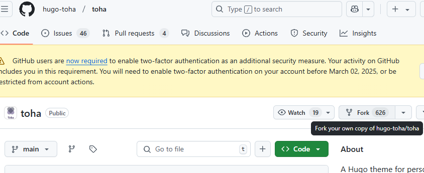

### Development

<details>
  <summary>Running the forked theme against your own site</summary>

#### Running the forked theme against your own site

[참고](https://toha-guides.netlify.app/posts/contributing/#running-the-forked-theme-against-your-own-site)

> 원활한 커스텀을 위해, 테마를 Fork하여 별도의 저장소로 관리.
>

과정은 간단합니다.
Go 개발시에 로컬 모듈을 go.mod에 추가하여 개발하는 방식과 동일 합니다.  
단, toha의 테마에 있는 설정들과 스크립트들이 `github.com/hugo-toha/toha/v4`를  
바라보고 있기 때문에 사설 레포의 경로로 변경해줘야 합니다.

1. toha의 테마 원격 저장소를 Fork 하여 본인의 Github로 가져 옵니다.  
   


2. 


혹시나 하는 에러 사태를 방지하기 위해 pre-commit을 통해 go 모듈의 경로를 로컬에서 리모트로 바꿔는 명령을 실행하게 하는게 좋습니다.

1. pre-commit 생성  
    ```shell
    #!/bin/bash

    # Git 프로젝트 루트 경로 가져오기
    GIT_ROOT=$(git rev-parse --show-toplevel)
    GO_MOD_FILE="$GIT_ROOT/go.mod"
    JS_CONF_FILE="$GIT_ROOT/assets/jsconfig.json"

    if [ ! -f "$GO_MOD_FILE" ]; then
        echo "❌ go.mod 파일을 찾을 수 없습니다!"
        exit 1
    fi

    echo "🔍 go.mod 수정 중..."

    # OS 확인 (macOS vs Linux)
    if [[ "$OSTYPE" == "darwin"* ]]; then
        SED_OPT="-i ''"
    else
        SED_OPT="-i"
    fi

    # 1️⃣ `github.com/codex-devlab/customs_theme/v4 v4.7.0` 앞의 `//` 주석 해제 (Indent 유지)
    sed $SED_OPT 's|^\([[:space:]]*\)//[[:space:]]*\(github.com/hugo-toha/toha/v4 => github.com/codex-devlab/customs_theme/v4 v4.7.0.*\)$|\1\2|' "$GO_MOD_FILE"

    # 2️⃣ `../customs_theme` 앞에 `//`가 없으면 주석 추가 (Indent 유지), 이미 주석이 있으면 추가 안함
    sed $SED_OPT '/github.com\/hugo-toha\/toha\/v4 => \.\.\/customs_theme/ { /\/\/[[:space:]]*/! s|^\([[:space:]]*\)\([^/].*\)$|\1// \2| }' "$GO_MOD_FILE"

    docker run -it -v $GIT_ROOT:/data/public --entrypoint /bin/sh hugo:1.3 -c "cd /data/public;hugo build;"

    if [ $? -ne 0 ]; then 
      echo "hugo build failed. Please check local repository."
      exit;
    fi

    # 3️⃣  add & git commit 실행 (수정된 파일을 다시 커밋하기)
    git add "$GO_MOD_FILE"
    git add "$JS_CONF_FILE"

    echo "✅ go.mod 파일이 자동으로 수정되었습니다."
    ```
2. 실행 권한 변경  
    ```shell
    $ chmod +x .git/hooks/pre-commit
    ```

정상적으로 동작이 되는지 확인하고 싶으면 직접 실행해 보는것도 좋습니다.  
직접 Git 명령어로 커밋 할때만 echo로 작성된 안내메시지가 나오니까 Vscode같은 IDE를 통해 커밋하시면 메세지는 안나옵니다.


</details>


### Writting Tips

<details>
<summary> Collapsed Sections </summary>

#### Collapsed Sections [^collapsed-sections] 


```html
<details>
  Collapsed text
</details>

<details>
  <summary>Details Title</summary>
  Collapsed text
</details>
```
<details>
<summary>Details Title</summary>
Collapsed text
</details>


</details>


<details>
<summary>Using undefined shortcodes Print</summary>

#### Using undefined shortcodes Print [^shortcode-escape]

메뉴얼을 위해 Hugo 의 Shortcode를 호출하는 code를 포스트안에 작성하려고 했으나,  
{{/*< ... >*/}} 의 형태로 작성되면 Hugo의 랜더링 과정에서 callout하게 되어,  
관련된 shortcode를 참조하게 됩니다.  

때문에 메뉴얼 작성을 위한 shortcode를 문자 그대로 출력하기 위해선, Escaping 과정을 거쳐야 합니다.  

여려가지 방법이 있었으나, code block안에서는 정상적으로 출력이 안되는 등 가능한 방법은 한가지 뿐이였습니다.

먼저 가능한 예제를 보여드리고, 불가능한 예제들도 소개해 드리겠습니다.  
저처럼 시행착오를 반복하기 않기를 바라겠습니다!  

`정상적인 Case`
* Shortcode 문자 그대로 출력하는 방법  
  {{\/*< ... >\*/}} 의 내부에 주석을 넣는 방법을 사용하면 됩니다.
  예를 들어 `tag list` 를 반환하는 `Shortcode` 를 작성 하고 싶다면, 하단처럼 작성하면 됩니다.

  ``` go
  
  ```

`실패한 Case` [^Liquid-Template-raw]
* {} 사용  
  liquid Template 언어에 따르면 {} ... {} 의 형태로 사용하면 일시적으로 랜더링을 멈출 수 있다고 하나, Hugo 는 `Go언어의 Template`을 사용하기 떄문에 적용 할 수 없습니다.    
  예전 Jekyll 때는 Liquid를 사용했으나 현재는 Hugo를 사용하므로 해당 방법은 적용 불가 합니다.


</details>


## Template

### Custom Layout
<details>
<summary>Example-All tag list Template</summary>

#### Example-All tag list Template

1. hugo.yaml 에서 markup unafe 설정 확인
2. layouts에 paritals와 shortcodes 생성

    ``` shell
    mkdir -p layouts/partials layouts/shortcodes
    ```
3. tag 리스트를 생성하는 partial custom-list.html 생성
    ```shell
    $ mkdir -p layouts/partials/tags
    $ vim layouts/partials/tags/custom-list.html
    <!-- layouts/partials/tags/custom-list.html -->
    <h2>All Tags</h2>
    <ul>
      {{ range $tag, $items := .Site.Taxonomies.tags }}
        <li><a href="{{ "/tags/" | relLangURL }}{{ $tag }}">{{ $tag }}</a> ({{ len $items }} posts)</li>
      {{ end }}
    </ul>
    :wq

    ```

4. 페이지 내부에서 custom-list 템플릿을 불러 올 수 있도록 partoal shortcode 생성
    ```shell
    vim layouts/shortcodes/partial.html
    {{ partial (.Get 0) . }}
    :wq


    ```


5. 특정 페이지 내에서 custom-list template 호출
    예시) contents/post/sample.md
    ``` markdown
    ---
    title: "Sample Post"
    date: 2025-01-01T09:12:43+05:00
    tags:
    - Hugo
    - Example
    #draft: false
    ---

    # Sample Post

    This page lists all tags:
    
 
   
    
    
    ```
6. 


</details>


### Creating Sub Category

https://toha-guides.netlify.app/posts/writing-posts/organizing/sub-category/example/


## Reference


[Hugo 관련 팁](https://github.com/kaushalmodi/ox-hugo/blob/main/test/site/content/posts/source-block-md-with-hugo-shortcodes.md)  

[toha sample blog](https://github.com/hugo-toha/hugo-toha.github.io)  
[toha Guide](https://toha-guides.netlify.app/)  
[toha Guide-Github](https://github.com/hugo-toha/guides)  


###### Foot Note

[^collapsed-sections]: [Github-collapsed-sections 참고](https://docs.github.com/en/get-started/writing-on-github/working-with-advanced-formatting/organizing-information-with-collapsed-sections)

[^shortcode-escape]: [Shortcodes escaped 참고](https://github.com/kaushalmodi/ox-hugo/blob/main/test/site/content/posts/source-block-md-with-hugo-shortcodes.md#shortcodes-escaped-shortcodes-escaped)

[^Liquid-Template-raw]: [Liquid Template raw 참고](https://shopify.github.io/liquid/tags/template/)