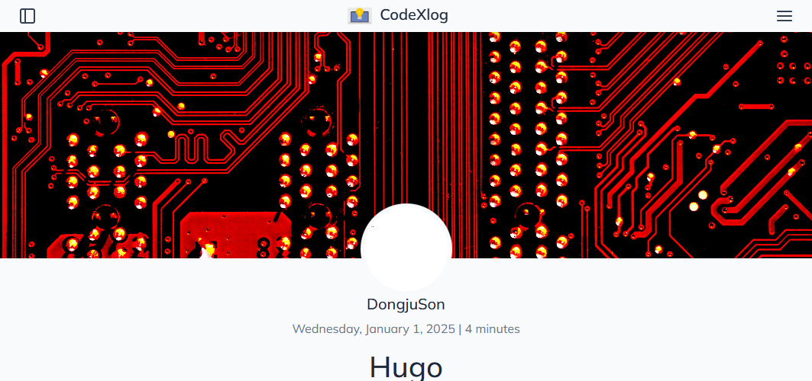

## Development

<details>
  <summary>Running the forked theme against your own site</summary>

### Running the forked theme against your own site

[참고](https://toha-guides.netlify.app/posts/contributing/#running-the-forked-theme-against-your-own-site)

> 원활한 커스텀을 위해, 테마를 Fork하여 별도의 저장소로 관리.
>

과정은 간단합니다.
Go 개발시에 로컬 모듈을 go.mod에 추가하여 개발하는 방식과 동일 합니다.  
단, toha의 테마에 있는 설정들과 스크립트들이 `github.com/hugo-toha/toha/v4`를  
바라보고 있기 때문에 사설 레포의 경로로 변경해줘야 합니다.

1. toha의 테마 원격 저장소를 Fork 하여 본인의 Github로 가져 옵니다.  
   저는 저장소를 Fork하면서 이름을 [customs_theme](github.com/codex-devlab/customs_theme) 로 변경했습니다.   
   > 처음 Fork 받은 후에는 Release가 없습니다.  
   > `반드시 다음 과정 진행 전에 릴리즈 해주세요.`  
   > 가급적 Fork 받은 당시의 Stable한 태그를 기준으로 원래의 저장소와 동일하게 Release 해주시면 됩니다.  

   


2. 모듈 경로 변경  
   `go.mod`의 모듈 경로를 fork 받아온 자신의 모듈 경로로 변경 합니다.
   ```go
   module github.com/codex-devlab/customs_theme/v4

   go 1.21
   ```
3. Hugo 블로그 저장소의 테마 모듈 경로 설정  
    Fork 받은 Custom Theme을 사용하고자 한다면, Hugo 블로그 저장소의 설정을 몇가지 변경해줘야 합니다.  
    * hugo.yaml 변경  
      기존의 모듈 경로를 Fork 받은 테마의 경로로 변경 합니다.  
      ```yaml
      # Use Hugo modules to add theme
      module:
        imports:
        - path: github.com/codex-devlab/customs_theme/v4
      ```


    * go.mod 변경  
      필요한 테마의 저장소 경로를 설정합니다.  
      위 과정에서 `릴리즈 버전(v4.7.1)`을 경로 뒤에 명시해 줍니다.  
      > 만약 로컬에서 테마를 개발중이라면, 주석으로 되어 있는 replace 부분 적절하게 변경하여서 사용하시면 됩니다.  
      > `단, 반드시 원격 저장소로 Push 전에 replace부분은 주석을 하거나 지워 주세요.`  


      ```go
      module github.com/codex-devlab/codex-devlab.github.io
      go 1.21

      // For Future costom update
      require github.com/codex-devlab/customs_theme/v4 v4.7.1 // indirect

      // For Running on Hugo container and develop custom theme
      //replace(
      //    github.com/codex-devlab/customs_theme/v4 => ../customs_theme
      //)

      ```


### Pre-Commit

Githook의 Pre-commit을 사용하면 협업에서 큰 도움이 됩니다.  
디버깅 지옥에서 벗어 날 수 있는 좋은 방법 입니다.

* 기능 리스트
  * `go.mod` replace 경로 자동 주석  
    로컬에서 개발하다가 원격으로 커밋할 때 가벼운 맘으로 푸시 했다가,  
    팀원들에게 디버깅 지옥을 선사한 적 있었나요?  
    항상 경각심을 가져야 합니다...  


혹시나 하는 에러 사태를 방지하기 위해 pre-commit을 통해 go 모듈의 경로를 로컬에서 리모트로 바꿔는 명령을 실행하게 하는게 좋습니다.

1. pre-commit 생성  
    ```shell
    #!/bin/bash

    # Git 프로젝트 루트 경로 가져오기
    GIT_ROOT=$(git rev-parse --show-toplevel)
    GO_MOD_FILE="$GIT_ROOT/go.mod"

    if [ ! -f "$GO_MOD_FILE" ]; then
        echo "❌ go.mod 파일을 찾을 수 없습니다!"
        exit 1
    fi

    echo "🔍 go.mod 수정 중..."

    # OS 확인 (macOS vs Linux)
    if [[ "$OSTYPE" == "darwin"* ]]; then
        SED_OPT="-i ''"
    else
        SED_OPT="-i"
    fi

    # 1️⃣ `replace(...)` 블록이 주석 처리되지 않았다면 주석 추가
    if ! grep -q "^[[:space:]]*//[[:space:]]*replace(" "$GO_MOD_FILE"; then
        sed $SED_OPT '/^[[:space:]]*replace(/, /^[[:space:]]*)/ s|^|// |' "$GO_MOD_FILE"
        echo "✅ replace(...) 블록이 주석 처리되었습니다."
    else
        echo "✅ replace(...) 블록이 이미 주석 처리되어 있습니다."
    fi

    # 2️⃣ 변경 사항을 git에 추가
    git add "$GO_MOD_FILE"

    echo "✅ go.mod 파일이 자동으로 수정되었습니다."

    ```
2. 실행 권한 변경  
    ```shell
    $ chmod +x .git/hooks/pre-commit
    ```

정상적으로 동작이 되는지 확인하고 싶으면 직접 실행해 보는것도 좋습니다.  
직접 Git 명령어로 커밋 할때만 echo로 작성된 안내메시지가 나오니까 Vscode같은 IDE를 통해 커밋하시면 메세지는 안나옵니다.


</details>


## Writting Tips

<details>
<summary> Collapsed Sections </summary>

### Collapsed Sections [^collapsed-sections] 


```html
<details>
  Collapsed text
</details>

<details>
  <summary>Details Title</summary>
  Collapsed text
</details>
```
<details>
<summary>Details Title</summary>
Collapsed text
</details>


</details>


<details>
<summary>Using undefined shortcodes Print</summary>

### Using undefined shortcodes Print [^shortcode-escape]

메뉴얼을 위해 Hugo 의 Shortcode를 호출하는 code를 포스트안에 작성하려고 했으나,  
{{/*< ... >*/}} 의 형태로 작성되면 Hugo의 랜더링 과정에서 callout하게 되어,  
관련된 shortcode를 참조하게 됩니다.  

때문에 메뉴얼 작성을 위한 shortcode를 문자 그대로 출력하기 위해선, Escaping 과정을 거쳐야 합니다.  

여려가지 방법이 있었으나, code block안에서는 정상적으로 출력이 안되는 등 가능한 방법은 한가지 뿐이였습니다.

먼저 가능한 예제를 보여드리고, 불가능한 예제들도 소개해 드리겠습니다.  
저처럼 시행착오를 반복하기 않기를 바라겠습니다!  

`정상적인 Case`
* Shortcode 문자 그대로 출력하는 방법  
  {{\/*< ... >\*/}} 의 내부에 주석을 넣는 방법을 사용하면 됩니다.
  예를 들어 `tag list` 를 반환하는 `Shortcode` 를 작성 하고 싶다면, 하단처럼 작성하면 됩니다.

  ``` go
  
  ```

`실패한 Case` [^Liquid-Template-raw]
* {} 사용  
  liquid Template 언어에 따르면 {} ... {} 의 형태로 사용하면 일시적으로 랜더링을 멈출 수 있다고 하나, Hugo 는 `Go언어의 Template`을 사용하기 떄문에 적용 할 수 없습니다.    
  예전 Jekyll 때는 Liquid를 사용했으나 현재는 Hugo를 사용하므로 해당 방법은 적용 불가 합니다.


</details>


## Template

### Custom Layout
<details>
<summary>Randomly changes the background image of the post</summary>

#### Randomly changes the background image of the post

각 포스트 마다 배경 이미지를 선택하지 않으면, theme에 등록되어 있는 기본 이미지만  
출력되도록 템플릿이 짜여 있습니다.  
글 작성시에 썸네일 같은 적당한 이미지가 있다면 모르겠지만,  
매번 새로운 이미지 찾아서 넣는것도 귀찮습니다.  

그래서 간단하게 별도의 배경 이미지 설정을 하지 않으면,  
미리 넣어둔 이미지 리스트 중에서 빌드시 랜덤으로 배경이 적용되는 기능으로 개선해보려 합니다.  

그럼 어떤 템플릿이 해당 기능을 하는지 먼저 알아야 합니다.  
크롬의 개발자 모드에 들어가서 각 엔트리에 맞는 템플릿을 찾아주면 됩니다.  

설명드린 배경은 하단의 그림 참고 부탁드립니다.



포스트 상단에 들어가는 이미지 입니다.

개발자 모드에 들어가시면 해당 부분은 <div> 태그로 되어 있는 이미지 입니다.
```html
<div class="hero-area col-sm-12" id="hero-area" style="background-image: url(/images/rand_images/michael-dziedzic.jpg);">
      </div>
```

이제 customs_theme에서 해당 클래스를 생성해주는 템플릿을 찾아주면 됩니다.


* customs_theme/layouts/_default/single.html  
  하단의 코드를 보시면 Partial의 `helpers/get-hero.html`을 호출하는 것을 확인 할 수 있습니다.  
  ```html
  <div class="hero-area col-sm-12" id="hero-area" style='background-image: url({{ partial "helpers/get-hero.html" . }});'>
  </div>
  ```


* customs_theme/layouts/partials/helpers/get-hero.html   
  전체 코드중에서 이미지를 결정 짓는 부분만 집중하시면 됩니다.  
  원래 위의 코드에서 각 포스트의 $heroImage가 설정되어 있으면 값을 가져오는 부분이 있습니다.  
  귀찮아서 이미지를 설정 하지 않았다면, 하단의 코드처럼 `images/default-hero.jpg`가  
  기본 이미지로 들어갑니다.
  ```html
  ...
  {{/* if hero image is not provided, then use the default hero image */}}
  {{ if not $heroImage }}
    {{ $heroImage := resources.Get "images/default-hero.jpg"}}
    {{ .Scratch.Set "heroScratch" $heroImage }}
  {{ end }}
  ...
  ```

자 그럼 어떻게 해야 할까요?
뇌피셜로는 그냥 assets/images 같은데에 이미지들 밀어 넣어두고,  
이중에서 랜덤으로 호출 하면 될 것 같은데,  
역시나 그렇게 편하게는 안됩니다.  


```html
{{/* if hero image is not provided, then use a random hero image */}}
{{ if not $heroImage }}
  {{ $heroImages := readDir "static/images/rand_images" }}  {{/* 이미지 디렉토리 읽기 */}}
  {{ $imageCount := len $heroImages }}
  {{ if gt $imageCount 0 }}  {{/* 이미지 파일이 하나 이상 있을 경우 */}}
    {{ $randomIndex := int (math.Floor (mul (float $imageCount) (math.Rand))) }}{{/* 현재 시간 기반 랜덤 인덱스 */}}

    {{ $randomImage := index $heroImages $randomIndex }}
    {{ $randomImagePath := printf "images/rand_images/%s" $randomImage.Name }}

    {{ $heroImage := resources.Get $randomImagePath }}
    {{ .Scratch.Set "heroScratch" $heroImage }}

  {{ end }}
{{ end }}

```


</details>


<details>
<summary>Example-All tag list Template</summary>

#### Example-All tag list Template

1. hugo.yaml 에서 markup unafe 설정 확인
2. layouts에 paritals와 shortcodes 생성

    ``` shell
    mkdir -p layouts/partials layouts/shortcodes
    ```
3. tag 리스트를 생성하는 partial custom-list.html 생성
    ```shell
    $ mkdir -p layouts/partials/tags
    $ vim layouts/partials/tags/custom-list.html
    <!-- layouts/partials/tags/custom-list.html -->
    <h2>All Tags</h2>
    <ul>
      {{ range $tag, $items := .Site.Taxonomies.tags }}
        <li><a href="{{ "/tags/" | relLangURL }}{{ $tag }}">{{ $tag }}</a> ({{ len $items }} posts)</li>
      {{ end }}
    </ul>
    :wq

    ```

4. 페이지 내부에서 custom-list 템플릿을 불러 올 수 있도록 partoal shortcode 생성
    ```shell
    vim layouts/shortcodes/partial.html
    {{ partial (.Get 0) . }}
    :wq


    ```


5. 특정 페이지 내에서 custom-list template 호출
    예시) contents/post/sample.md
    ``` markdown
    ---
    title: "Sample Post"
    date: 2025-01-01T09:12:43+05:00
    tags:
    - Hugo
    - Example
    #draft: false
    ---

    # Sample Post

    This page lists all tags:
    
 
   
    
    
    ```
6. 


</details>


### Creating Sub Category

https://toha-guides.netlify.app/posts/writing-posts/organizing/sub-category/example/


## Reference


[Hugo 관련 팁](https://github.com/kaushalmodi/ox-hugo/blob/main/test/site/content/posts/source-block-md-with-hugo-shortcodes.md)  

[toha sample blog](https://github.com/hugo-toha/hugo-toha.github.io)  
[toha Guide](https://toha-guides.netlify.app/)  
[toha Guide-Github](https://github.com/hugo-toha/guides)  


###### Foot Note

[^collapsed-sections]: [Github-collapsed-sections 참고](https://docs.github.com/en/get-started/writing-on-github/working-with-advanced-formatting/organizing-information-with-collapsed-sections)

[^shortcode-escape]: [Shortcodes escaped 참고](https://github.com/kaushalmodi/ox-hugo/blob/main/test/site/content/posts/source-block-md-with-hugo-shortcodes.md#shortcodes-escaped-shortcodes-escaped)

[^Liquid-Template-raw]: [Liquid Template raw 참고](https://shopify.github.io/liquid/tags/template/)