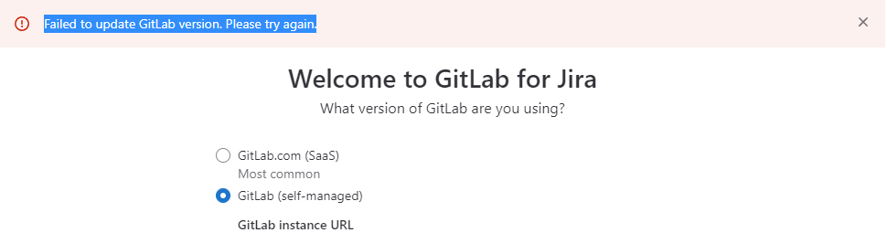
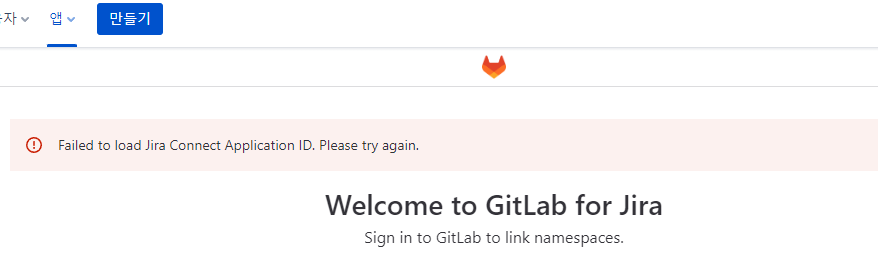

# Gitlab Upgrade History

Gitlab의 업그레이드 과정은 하단의 Upgrade Path([https://docs.gitlab.com/ee/update/#upgrade-paths](https://docs.gitlab.com/ee/update/#upgrade-paths))를 준수 하며 진행해야 합니다.

위 경로대로 업그레이드를 진행하지 않으면, 하위 호완성의 문제로 구동이 불가능 하거나 데이터 베이스 오류등 다양한 에러가 발생 할 수 있습니다.

None Stop 업그레이드는 이중화 구성이 되어있지 않은 인스턴스에서는 불가능 하기에, 업그레이드 과정중에는 반드시 서비스의 중단을 공지한 후 진행하시기 바랍니다.

마지막으로 업그레이드 과정에서 Gitlab Rails에서 Background Migration 작업을 진행 하게 되는데, 해당 과정은 Major 버전이 올라가거나, 업그레이드 경로 상 마지막 과정에서 상당 시간이 소요 됩니다.

> 다음 버전으로의 업그레이드느 반드시 Background Migration 작업이 완료 된 후 진행해야 합니다.


## Upgrade Path

1. 현재 사용중인 버전의 가장 최신 패치 버전으로 업그레이드.
    
    ex) 11.10.6 (현재 11.10.x 버전) →11.10.8 (11.10.x 중 최신)
    
2. 이전 마이너의 최신 패치 버전에서 다음 마이너의 초기 버전으로 업그레이드
    
    ex) 11.10.8 (11.10.x 중 최신)→11.11.0 (11.11.x 초기 버전)
    
3. 현재 마이너의 최신 패치 버전으로 업그레이드
    
    ex) 11.11.0 (11.11.x 초기 버전)→11.11.8 (11.11.x 중 최신)
    
4. 현재 메이저 버전중 가장 최신 버전에서 다음 메이저의 최초 마이너의 최신 패치 버전으로 업그레이드
    
    ex) 11.11.8 (11.11.x 중 최신)→12.0.12 (12.0.x 중 최신)
    
5. Gitlab Upgrade paths에 따라 업그레이드 진행
    
    8.11.Z -> 8.12.0 -> 8.17.7 -> 9.0.13 -> 9.5.10 -> 10.0.7 -> 10.8.7 -> 11.0.6 -> 11.11.8 -> 12.0.12 -> 12.1.17 -> 12.10.14 -> 13.0.14 -> 13.1.11 -> 13.8.8 -> 13.12.15 -> 14.0.12 -> 14.3.6 -> 14.9.5 -> 14.10.Z -> 15.0.Z -> 15.1.Z (for GitLab instances with multiple web nodes) -> 15.4.0 -> latest 15.Y.Z
    
    14.10.5→15.0.5→15.1.6→15.4.0→15.5.6→15.6.2
    
## Upgrade Guide
    
> 11.10.8-ce.0 버전에서 시작
    
- docker 이미지 pull
    
    ```java
    docker pull gitlab/gitlab-ce:11.10.8-ce.0
    ```
    
- Main Server에서 Gitlab 폴더 생성
    
    ```java
    mkdir -p /Image/custom_dev_gitlab/
    ```
    
- Gitlab Server에서 Main Server로 config 폴더 복사
    
    ```java
    scp -r /data/docker/custom_dev_gitlab/config root@172.29.241.100:/Image/custom_dev_gitlab/
    ```
    
- Main Server에서 Docker Dompose 파일 작성
    
    `vi /Image/custom_dev_gitlab/docker-compose.yml`
    
    ```java
    services:
      web:
        image: 'gitlab/gitlab-ce:11.10.8-ce.0'
        restart: always
        hostname: 'dev-gitlab'
        container_name: custom_dev_gitlab
        environment:
          GITLAB_OMNIBUS_CONFIG: |
            # Add any other gitlab.rb configuration here, each on its own line
            external_url '<http://182.114.70.81:32000>'
            gitlab_rails['gitlab_shell_ssh_port'] = 8102
        ports:
          - '32000:32000'
          - '8102:22'
        volumes:
          - '/Storage/docker/custom_dev_gitlab/config:/etc/gitlab'
          - '/Storage/docker/custom_dev_gitlab/logs:/var/log/gitlab'
          - '/Storage/docker/custom_dev_gitlab/data:/var/opt/gitlab'
          - /etc/localtime:/etc/localtime:ro
    ```
    
- Docker Compose 시작
    
    ```java
    docker compose up -d
    ```
    
- Gitlab 컨테이너 로그 확인
    
    ```java
    docker logs -f custom_dev_gitlab
    ```
    
- Gitlab Server에서 Main Server로 백업 파일 복사
    
    ```java
    scp /data/docker/custom_dev_gitlab/data/backups/ /Storage/docker/custom_dev_gitlab/data/backups/
    ```
    
- 백업파일 권한 부여
    
    ```java
    chown 998:0 /Storage/docker/custom_dev_gitlab/data/backups/1671738795_2022_12_23_11.10.8_gitlab_backup.tar
    ```
    
- 복구 진행
    
    ```java
    # 호스트에서 gitlab-ce docker 쉘 진입
    docker exec -it custom_dev_gitlab /bin/bash
    # gitlab-ce docker 쉘에서 진행
    gitlab-ctl stop unicorn # 웹서비스가 puma 인 경우에는 puma
    gitlab-ctl stop sidekiq
    gitlab-rake gitlab:backup:restore BACKUP=/var/opt/gitlab/backups/1671738795_2022_12_23_11.10.8
    Unpacking backup ... done
    Before restoring the database, we will remove all existing
    tables to avoid future upgrade problems. Be aware that if you have
    custom tables in the GitLab database these tables and all data will be
    removed.
    
    Do you want to continue (yes/no)? yes
    Removing all tables. Press `Ctrl-C` within 5 seconds to abort
    2022-12-15 14:07:17 +0900 -- Cleaning the database ...
    2022-12-15 14:07:21 +0900 -- done
    2022-12-15 14:07:21 +0900 -- Restoring database ...
    Restoring PostgreSQL database gitlabhq_production ...
    ...
    
    2023-02-05 11:46:02 +0900 -- Restoring lfs objects ...
    2023-02-05 11:46:04 +0900 -- done
    This task will now rebuild the authorized_keys file.
    You will lose any data stored in the authorized_keys file.
    Do you want to continue (yes/no)?yes
    ```
    
- Gitlab 서비스 재시작
    
    ```java
    # gitlab-ce docker 쉘에서 진행
    gitlab-ctl restart
    ```
    
    - Admin 패스워드 변경
    
    ```java
    # gitlab-ce docker 쉘에서 진행
    gitlab-rails console
    -------------------------------------------------------------------------------------
     GitLab:       11.10.8 (313bd8e65df)
     GitLab Shell: 9.0.0
     PostgreSQL:   9.6.11
    -------------------------------------------------------------------------------------
    Loading production environment (Rails 5.0.7.2)
    irb(main):001:0> user = User.find(1)
    => #<User id:1 @administrator>
    irb(main):002:0> new_password = '원하는 패스워드 설정'
    => "원하는 패스워드 설정"
    irb(main):003:0> user.password = new_password
    => "원하는 패스워드 설정"
    irb(main):004:0> user.password_confirmation = new_password
    => "원하는 패스워드 설정"
    irb(main):005:0> user.save!
    Enqueued ActionMailer::DeliveryJob (Job ID: 1ac763a2-1672-4719-bc0c-1e1355ef35cc) to Sidekiq(mailers) with arguments: "DeviseMailer", "password_change", "deliver_now", #<GlobalID:0x00007fd1f81f4d80 @uri=#<URI::GID gid://gitlab/User/1>>
    => true
    irb(main):006:0>exit
    ```
    
> 11.11.0-ce.0 업그레이드
    
- docker-compose.yml 이미지 변경
    
    ```java
    services:
      web:
        image: 'gitlab/gitlab-ce:11.11.0-ce.0'
        restart: always
        hostname: 'dev-gitlab'
        container_name: custom_dev_gitlab
        environment:
          GITLAB_OMNIBUS_CONFIG: |
            # Add any other gitlab.rb configuration here, each on its own line
            external_url '<http://182.114.70.81:32000>'
            gitlab_rails['gitlab_shell_ssh_port'] = 8102
            gitlab_rails['time_zone'] = 'Asia/Seoul'
        ports:
          - '32000:32000'
          - '8102:22'
        volumes:
          - '/Image/custom_dev_gitlab/config:/etc/gitlab'
          - '/Image/custom_dev_gitlab/logs:/var/log/gitlab'
          - '/Image/custom_dev_gitlab/data:/var/opt/gitlab'
          - /etc/localtime:/etc/localtime:ro
    ```
    
- Docker Compose 재시작
    
    ```java
    docker compose down
    docker compose up -d
    ```
    
- Gitlab 컨테이너 로그 확인
    
    ```java
    docker logs -f custom_dev_gitlab
    ```
    
> 11.11.8-ce.0 업그레이드
    
- docker-compose.yml 이미지 변경 후 11.11.0-ce.0 업그레이드와 동일한 방법으로 진행
    
    ```java
    ...
        image: 'gitlab/gitlab-ce:11.11.8-ce.0'**
    ...
    ```
    
> 12.0.12-ce.0 업그레이드
    
- docker-compose.yml 이미지 변경 후 11.11.0-ce.0 업그레이드와 동일한 방법으로 진행
    
    ```java
    ...
        image: 'gitlab/gitlab-ce:12.0.12-ce.0'**
    ...
    ```
    
> 12.1.17-ce.0 업그레이드
    
- docker-compose.yml 이미지 변경 후 11.11.0-ce.0 업그레이드와 동일한 방법으로 진행
    
    ```java
    ...
        image: 'gitlab/gitlab-ce:12.1.17-ce.0'**
    ...
    ```
    
> 12.10.14-ce.0 업그레이드
    
- docker-compose.yml 이미지 변경 후 11.11.0-ce.0 업그레이드와 동일한 방법으로 진행
    
    ```java
    ...
        image: 'gitlab/gitlab-ce:12.10.14-ce.0'**
    ...
    ```
    
> 13.0.14-ce.0 업그레이드
    
- docker-compose.yml 이미지 변경 후 11.11.0-ce.0 업그레이드와 동일한 방법으로 진행
    
    ```java
    ...
        image: 'gitlab/gitlab-ce:13.0.14-ce.0'**
    ...
    
    ```
    
> 13.1.11-ce.0 업그레이드
    
- docker-compose.yml 이미지 변경 후 11.11.0-ce.0 업그레이드와 동일한 방법으로 진행
    
    ```java
    ...
        image: 'gitlab/gitlab-ce:13.1.11-ce.0'**
    ...
    
    ```
    
> 13.8.8-ce.0 업그레이드
    
- docker-compose.yml 이미지 변경 후 11.11.0-ce.0 업그레이드와 동일한 방법으로 진행
    
    ```java
    ...
        image: 'gitlab/gitlab-ce:13.8.8-ce.0'**
    ...
    ```
    
> 13.12.15-ce.0 업그레이드
    
반드시 이전 단계에서 legacy storage를 hashed storage 로 변경 후 진행
    
- docker-compose.yml 이미지 변경
    
    ```java
    ...
        image: 'gitlab/gitlab-ce:13.12.15-ce.0'**
    ...
    ```
    
- Gitlab console에 진입하여 read-only 상태인 프로젝트들의 read-only 상태 해제
    
    ```java
    # 호스트에서 gitlab-ce docker 쉘 진입
    docker exec -it custom_dev_gitlab /bin/bash
    # Gitlab consoe 진입
    gitlab-rails console
    --------------------------------------------------------------------------------
     Ruby:         ruby 2.7.2p137 (2020-10-01 revision 5445e04352) [x86_64-linux]
     GitLab:       13.12.15 (6614e1562c6) FOSS
     GitLab Shell: 13.18.1
     PostgreSQL:   12.6
    --------------------------------------------------------------------------------
    Loading production environment (Rails 6.0.3.7)
    
    # 프로젝트들 중에서 read only프로젝트가 true인 레포가 있다면 하단 업데이트 진행
    projects = Project.where(repository_read_only: true)
    projects.each do |p|
      print p
    end
    
    # read-only 상태인 프로젝트들의 read-only 상태 해제, end까지 한번에 복사해서 붙여넣기후 실행
    projects = Project.where(repository_read_only: true)
    projects.each do |p|
      p.update!(repository_read_only:nil)
    end
    # console 빠져나오기
    exit
    
    ```
    
    하단처럼 read only로 되어 있는거 나옴
    
    ```java
    => [#<Project id:363 codex/stamper-go>>, #<Project id:364 jellywing/stamper-go>>, #<Project id:367 dev-subbuilder-go/service-registry>>, #<Project id:31 dev-rankup-vex/dev-rankup-public/rankup-console>>]
    
    ```
    
    그렇게 해도 해싱 되지 않아서 안나오는레포들이있어서 하단 명령어 실행 하여 전부 조회
    
    만약 레포에 들어갔는데 빈 레포로 나오면 하단의 작업 반드시 수행
    
    - Before upgrade to 14.x, Prerequisites 반드시 하단의 링크로 들어가서 주의사항 정독!!!
        
        [Upgrading GitLab | GitLab](https://docs.gitlab.com/ee/update/#1400)
        
        - migrating [to hashed storage](https://docs.gitlab.com/ee/administration/raketasks/storage.html#migrate-to-hashed-storage)
            
            13.8.8 에서 완료
            
            만약 해싱이 안되어 있으면, `gitlab-rake gitlab:check SANITIZE=true` 이 단계에서 확인 가능
            
        - migrating [to Puma](https://docs.gitlab.com/ee/administration/operations/puma.html)
            
            하단 처럼 상태에 puma가 돌고 있으면 문제 없지만,안전하게 업그레이드 하기 위해 gitlab.rb에서 puma 설정을 enable 로 바꾼후 gitlab-ctl reconfigure 실행
            
            ```java
            gitlab-ctl status
            run: alertmanager: (pid 1595) 335s; run: log: (pid 1296) 358s
            run: gitaly: (pid 1471) 336s; run: log: (pid 535) 442s
            run: gitlab-exporter: (pid 1470) 336s; run: log: (pid 1109) 376s
            run: gitlab-workhorse: (pid 1436) 337s; run: log: (pid 824) 388s
            run: grafana: (pid 1622) 334s; run: log: (pid 1387) 346s
            run: logrotate: (pid 442) 457s; run: log: (pid 450) 456s
            run: nginx: (pid 830) 385s; run: log: (pid 857) 382s
            run: postgres-exporter: (pid 1613) 334s; run: log: (pid 1338) 352s
            run: postgresql: (pid 614) 439s; run: log: (pid 625) 438s
            run: prometheus: (pid 1568) 336s; run: log: (pid 1261) 364s
            run: puma: (pid 742) 403s; run: log: (pid 749) 402s
            run: redis: (pid 454) 451s; run: log: (pid 462) 449s
            run: redis-exporter: (pid 1481) 336s; run: log: (pid 1184) 370s
            run: sidekiq: (pid 756) 397s; run: log: (pid 767) 395s
            run: sshd: (pid 31) 467s; run: log: (pid 30) 467s
            
            ```
            
    
> 14.0.12-ce.0 업그레이드
    
- docker-compose.yml 이미지 변경
    
    ```java
    ...
        image: 'gitlab/gitlab-ce:14.0.12-ce.0'**
    ...
    ```
    
- unicorn 에 해당되는 부분들 주석 처리
    
    `vi /Storage/docker/custom_dev_gitlab/config/gitlab.rb`
    
    ```java
    # unicorn['enable'] = true
    # 그외에도 unicorn 관련된 부분 모두 주석 처리
    ```
    
- puma 활성화
    
    `vi /Storage/docker/custom_dev_gitlab/config/gitlab.rb`
    
    ```java
    puma['enable'] = true
    ```
    
- Docker Compose 재시작
    
    ```java
    docker compose down
    docker compose up -d
    ```
    
- Gitlab 컨테이너 로그 확인
    
    ```java
    docker logs -f custom_dev_gitlab
    ```
    
- Issue
    - 웹페이지 표시 불가 및 에러 로그
        
        이전 14버전으로 넘어오기전 13버전 마지막 즈음에서 hashed storage로 변환이 이루어지지 않아서 발생
        
        ```java
        https_test_gitlab  |
        https_test_gitlab  | Running handlers:
        https_test_gitlab  | Running handlers complete
        https_test_gitlab  | Chef Infra Client finished, 316/1392 resources updated in 01 minutes 33 seconds
        https_test_gitlab  | gitlab Reconfigured!
        https_test_gitlab  | Checking for unmigrated data on legacy storage
        https_test_gitlab  |
        https_test_gitlab  | Legacy storage is no longer supported. Please migrate your data to hashed storage.
        https_test_gitlab  | Check <https://docs.gitlab.com/ee/administration/raketasks/storage.html#migrate-to-hashed-storage> for details.
        https_test_gitlab  |
        https_test_gitlab  | Upgrade failed. Retry the upgrade after migrating your data to hashed storage.
        
        ```
            
    - 무한 재시작
        
        하단 처럼 계속해서 재시작 된다면, Gitlab 도커를 완전히 종료(docker compose down 후 시작)
        
        ```java
        Upgrade failed. Could not check for unmigrated data on legacy storage.
        
        If you would like to restart the instance without perfming this check
        check, add the following to your docker command:
        -e GITLAB_SKIP_UNMIGRATED_DATA_CHECK=true
        
        Thank you for using GitLab Docker Image!
        Current version: gitlab-ce=14.0.12-ce.0
        
        Configure GitLab for your system by editing /etc/gitlab/gitlab.rb file
        And restart this container to reload settings.
        To do it use docker exec:
        
          docker exec -it gitlab editor /etc/gitlab/gitlab.rb
          docker restart gitlab
        
        For a comprehensive list of configuration options please see the Omnibus GitLab readme
        <https://gitlab.com/gitlab-org/omnibus-gitlab/blob/master/README.md>
        
        If this container fails to start due to permission problems try to fix it by executing:
        
          docker exec -it gitlab update-permissions
          docker restart gitlab
        
        ```
            
    
> 14.3.6-ce.0 업그레이드
    
- docker-compose.yml 이미지 변경 후 11.11.0-ce.0 업그레이드와 동일한 방법으로 진행
    
    ```java
    ...
        image: 'gitlab/gitlab-ce:14.3.6-ce.0'**
    ...
    ```
    
> 14.9.5-ce.0 업그레이드
    
- docker-compose.yml 이미지 변경 후 11.11.0-ce.0 업그레이드와 동일한 방법으로 진행
    
    ```java
    ...
        image: 'gitlab/gitlab-ce:14.9.5-ce.0'**
    ...
    ```
    
> 14.10.5-ce.0 업그레이드
    
- docker-compose.yml 이미지 변경 후 11.11.0-ce.0 업그레이드와 동일한 방법으로 진행
    
    ```java
    ...
        image: 'gitlab/gitlab-ce:14.10.5-ce.0'**
    ...
    ```
    
> 15.0.5-ce.0 업그레이드
    
- docker-compose.yml 이미지 변경 후 11.11.0-ce.0 업그레이드와 동일한 방법으로 진행
    
    ```java
    ...
        image: 'gitlab/gitlab-ce:15.0.5-ce.0'**
    ...
    ```
    
> 15.1.6-ce.0 업그레이드
    
- docker-compose.yml 이미지 변경 후 11.11.0-ce.0 업그레이드와 동일한 방법으로 진행
    
    ```java
    ...
        image: 'gitlab/gitlab-ce:15.1.6-ce.0'**
    ...
    ```
    
> 15.4.6-ce.0 업그레이드
    
- docker-compose.yml 이미지 변경 후 11.11.0-ce.0 업그레이드와 동일한 방법으로 진행
    
    ```java
    ...
        image: 'gitlab/gitlab-ce:15.4.6-ce.0'**
    ...
    ```
    
> 15.9.0-ce.0 업그레이드
    
- docker-compose.yml 이미지 변경 후 11.11.0-ce.0 업그레이드와 동일한 방법으로 진행
    
    ```java
    ...
        image: 'gitlab/gitlab-ce:15.4.6-ce.0'**
    ...
    ```
    
    15.9.0 버전 까지 업그레이드를 마쳤다면, 이후 최신버전으로 업그레이드는 별도의 Upgrade Path를 준수할 필요 없습니다.
    

업그레이드 과정에서 자주 발생하는 에러에 대해서는 하단의 Debug History 참고 부탁드립니다.

---

# Debug History

- Jira Gitlab Integration
    
## Gitlab Jira Integration Issue
    
    
Vm에서서 구동중인 신규로 구축한 Gitlab의 15.9.0~15.9.3  까지의 의 Jira 연동 시도
    
    
    
- 도메인 주소 변경([jira-test-ce.devlab.com](http://jira-test-ce.devlab.com/) → [jira-ce.devlab.com)](http://jira-ce.devlab.com/)
도메인 주소가 길어진 경우 이유를 알 수 없으나 Jira에서 Gitlab도메인을 인증 불가
- Gitlab에 Admin권한을 가진 계정이 반드시 Jira의 Admin계정과 일치
현재 Jira는 admin 을 사용중이며, Gitlab에서도 해당 계정으로 연동을 진행해야만 정상적으로 Jira에서 Oatuh 가능
- Gitlab의 Network Inboud 규칙 추가
local host와 내/외부 접근 IP에 대한 규칙이 추가 되어 있어야 Jira에서 오는 API가 정상적으로 동작
- Jira의 API Key Gitlab 중복 연동 불가
서로 다를 도메인과 VM에서 실행중인 Gitlab에 동일한 Jira의 API키를 연동하면 먼저 연결한 쪽은 문제가 없지만, 나중에 연결한 Gitlab은 namespace인식을 못 함
- 연동시에 사용하는 포트 이슈
    - 443 Port 반드시 오픈
    VM에서 신규로 구축한 Gitlab 을 연동할 때에는 443포트만 오픈 하여도 문제없이 연동이 되었지만, 현재 사내에서 운영중인 Gitlab서버에 동일한 설정후 연동을 진행 하려고 하면 문제 발생.
    차이점은 VM은 any:any 방식으로 NAT 연결, Gitlab server는 포트 포워딩 방식으로 연결되어 있음
- Jira Gitlab 연동 플러그인 에러
    - Failed to update Gitlab version. Please try again.
    하단의 그림처럼 버전을 업데이트 해야 한다는 에러 메세지가 나옴
    최신버전(15.9.0 이상)의 Gitlab을 Container로 새로 구축해서 연동 해도 동일
        
        
        
    - Failed to load Jira Connect Application ID. Please try again.
    OAuth 인증을 위해 Gitlab으로 이동시 하단의 화면처럼 에러 리턴
        
        
            
    
## Git Upgrade Issue
    
    
> 13.8.8 → 15.9.3 업그레이드 이슈 해결
    
    
    
### Registry Not Exist  
새로운 Gitlab에서 해당 설정 disable 하고 재시작 후 복구 진행 시, Registry가 없다는 이유로 복구가 중단 됨
원인은 백업 파일을 생성한 Gitlab에는 Registry 설정이 없거나 비활성화 되어있는 상태에서 백업을 받았고, 새로운 Gitlab에서는 기본 설정으로 Registry 기능이 활성화 되어 있어서 복구 과정에서 상단과 같은 문제 발생
- 해결 방법
        
    원래는 config 의 gitlab.rb에서 해야 하지만 편의를 위해 도커 컴포즈 파일의 환경 설정 에서 적용
    
    ```java
    registry['enable'] = false
    ```
            
### storage Hashing  
해당 이슈가 해결 안되면 500 error 가 뜨거나, 무한 재부팅 이슈 발생
- 해결 방법
        
    ```java
    All projects are in hashed storage? ... no
        Try fixing it:
        Please migrate all projects to hashed storage
        as legacy storage is deprecated in 13.0 and support will be removed in 14.0.
        For more information see:
        doc/administration/repository_storage_types.md
    ```
    
    gitlab:check 에서 projects hashed storage 이슈 발생 [Gitlab-13.4.0 Upgrading Instruction](https://docs.gitlab.com/ee/update/#upgrade-paths) 에 따르면, 13.4.0 부터 모든 레포들을 반드시 Hashed Storage로 변환해야 함
            
### readonly project  
Readonly Project로 설정 되고 나면, 해당 프로젝트에 어떠한 것도 업로드 할 수 없음
예를 들어, Push, MR, Issue등 아무것도 업로드/생성 불가
- 해결 방법
    
    ```bash
    # 호스트에서 gitlab-ce docker 쉘 진입
    $ docker exec -it custom_dev_gitlab /bin/bash
    # Gitlab consoe 진입
    gitlab-rails console
    --------------------------------------------------------------------------------
        Ruby:         ruby 2.7.2p137 (2020-10-01 revision 5445e04352) [x86_64-linux]
        GitLab:       13.12.15 (6614e1562c6) FOSS
        GitLab Shell: 13.18.1
        PostgreSQL:   12.6
    --------------------------------------------------------------------------------
    Loading production environment (Rails 6.0.3.7)
    
    # 프로젝트들 중에서 read only프로젝트가 true인 레포가 있다면 하단 업데이트 진행
    projects = Project.where(repository_read_only: true)
    projects.each do |p|
        print p
    end
    
    # read-only 상태인 프로젝트들의 read-only 상태 해제, end까지 한번에 복사해서 붙여넣기후 실행
    projects = Project.where(repository_read_only: true)
    projects.each do |p|
        p.update!(repository_read_only:nil)
    end
    # console 빠져나오기
    exit
    
    ```
            
### service not enable  
puma service 활성화를 안하면 Background migration 부분에서 **무한 루프**
- 해결 방법
        
    ```java
    gitlab-ctl status
    run: alertmanager: (pid 1595) 335s; run: log: (pid 1296) 358s
    run: gitaly: (pid 1471) 336s; run: log: (pid 535) 442s
    run: gitlab-exporter: (pid 1470) 336s; run: log: (pid 1109) 376s
    run: gitlab-workhorse: (pid 1436) 337s; run: log: (pid 824) 388s
    run: grafana: (pid 1622) 334s; run: log: (pid 1387) 346s
    run: logrotate: (pid 442) 457s; run: log: (pid 450) 456s
    run: nginx: (pid 830) 385s; run: log: (pid 857) 382s
    run: postgres-exporter: (pid 1613) 334s; run: log: (pid 1338) 352s
    run: postgresql: (pid 614) 439s; run: log: (pid 625) 438s
    run: prometheus: (pid 1568) 336s; run: log: (pid 1261) 364s
    run: puma: (pid 742) 403s; run: log: (pid 749) 402s
    run: redis: (pid 454) 451s; run: log: (pid 462) 449s
    run: redis-exporter: (pid 1481) 336s; run: log: (pid 1184) 370s
    run: sidekiq: (pid 756) 397s; run: log: (pid 767) 395s
    run: sshd: (pid 31) 467s; run: log: (pid 30) 467
    ```
            
### DB Error  
Postgresql의 마이그레이션시 발생하는 이슈가 해결 안되면 **유저 등록 불가, 특정 페이지 접근 불가, 프로젝트 생성 불가, 저장소 연결(push, clone…) 불가** 이슈 발생

- 해결 방법

    하단의 쿼리를 Postgresql 에서 실행하여 이슈가 발생한 테이블 삭제 필요
        
    ```bash
    gitlabhq_production=> DELETE FROM ci_group_variables;
    DELETE 0
    gitlabhq_production=> DELETE FROM ci_variables;
    DELETE 72
    gitlabhq_production=>
    gitlabhq_production=> UPDATE projects SET runners_token = null, runners_token_encrypted = null;
    UPDATE 350
    gitlabhq_production=> UPDATE namespaces SET runners_token = null, runners_token_encrypted = null;
    UPDATE 198
    gitlabhq_production=> UPDATE application_settings SET runners_registration_token_encrypted = null;
    UPDATE 1
    gitlabhq_production=> UPDATE application_settings SET encrypted_ci_jwt_signing_key = null;
    UPDATE 1
    gitlabhq_production=> UPDATE ci_runners SET token = null, token_encrypted = null;
    UPDATE 81
    gitlabhq_production=>
    gitlabhq_production=> UPDATE ci_builds SET token = null, token_encrypted = null;
    UPDATE 60857
    gitlabhq_production=>
    gitlabhq_production=> TRUNCATE web_hooks CASCADE;
    NOTICE:  truncate cascades to table "web_hook_logs"
    TRUNCATE TABLE
    gitlabhq_production=>
    DELETE FROM ci_group_variables;
    DELETE FROM ci_variables;
    UPDATE projects SET runners_token = null, runners_token_encrypted = null;
    UPDATE namespaces SET runners_token = null, runners_token_encrypted = null;
    UPDATE application_settings SET runners_registration_token_encrypted = null;
    UPDATE ci_runners SET token = null, token_encrypted = null;
    UPDATE ci_builds SET token = null, token_encrypted = null;
    TRUNCATE web_hooks CASCADE;
    DELETE FROM application_settings;
    ```
            
### ProjectImportData failures
        
```java
[2023-02-09T18:20:27.909506 #8920] INFO -- : - ProjectImportData failures: 1
[2023-02-09T18:20:27.909587 #8920] DEBUG -- : - ProjectImportData[9]: credentials
```

[https://gitlab.com/gitlab-org/gitlab/-/issues/285080](https://gitlab.com/gitlab-org/gitlab/-/issues/285080)

- 해결 방법  
    
    하단의 예제는 credentials에 오류가 있는 컬럼을 찾아서 null 로 초기화 하는 코드
    
    ```bash
    $ gitlab-rails c
    
    # Find the ids of the corrupt ProjectImportData objects
        total = 0
        bad = []
        ProjectImportData.find_each do |data|
        begin
            total += 1
            data.credentials
        rescue => e
            bad << data.id
        end
        end
    
        puts "Bad count: #{bad.count} / #{total}"
    
        # See the bad ProjectImportData ids
        bad
    
        # Remove the corrupted credentials
        import_data = ProjectImportData.where(id: bad)
        import_data.each do |data|
        data.update_columns({ encrypted_credentials: nil, encrypted_credentials_iv: nil, encrypted_credentials_salt: nil})
        end
    
    ```
    
- 예시
    
    ```java
    irb(main):001:0>   total = 0
    => 0
    irb(main):002:0>   bad = []
    => []
    irb(main):003:1*   ProjectImportData.find_each do |data|
    irb(main):004:2*     begin
    irb(main):005:2*       total += 1
    irb(main):006:2*       data.credentials
    irb(main):007:2*     rescue => e
    irb(main):008:2*       bad << data.id
    irb(main):009:1*     end
    irb(main):010:0>   end
    => nil
    irb(main):011:0> puts "Bad count: #{bad.count} / #{total}"
    Bad count: 1 / 1
    => nil
    irb(main):012:0> bad
    => [9]
    irb(main):013:0> import_data = ProjectImportData.where(id: bad)
    => #<ActiveRecord::Relation [#<ProjectImportData id: 9, project_id: 28, data: nil, encrypted_credentials: "bBpRdlKeY+/yggOwozgG7kLwOr7gjZxPk0MQQxWueLFO70WSwu...", encrypted_credentials_iv: "SA6wLgm6kdMQGLrk/Fq+kA==\\n", encr...
    irb(main):014:0> iedentials_salt: nil})
    irb(main):014:1* import_data.each do |data|
    irb(main):015:1*   data.update_columns({ encrypted_credentials: nil, encrypted_credentials_iv: nil, encrypted_credentials_salt: nil})
    irb(main):016:0> end
    => [#<ProjectImportData id: 9, project_id: 28, data: nil, encrypted_credentials: nil, encrypted_credentials_iv: nil, encrypted_credentials_salt: nil, credentials: nil>]
    
    ```
            
### Fix integrations and webhooks
      
최신 버전의 가이드 → [Back up and restore GitLab | GitLab](https://docs.gitlab.com/ee/raketasks/backup_restore.html#fix-integrations-and-webhooks)
현재 버전의 가이드 → [Back up and restore GitLab | GitLab](https://docs.gitlab.com/13.12/ee/raketasks/backup_restore.html#fix-project-integrations)

logs/gitlab-rails 에서 production.log 를 보면 하단과 같이 나옴
    
- Jira 연동 에러 Log
    - 해결 방법  
        하단의 쿼리 실행
        
        ```java
        gitlabhq_production=> delete from jira_connect_installations;
        DELETE 1
        gitlabhq_production=> delete from jira_connect_subscriptions;
        DELETE 0
        gitlabhq_production=> delete from jira_imports;
        DELETE 0
        gitlabhq_production=> delete from jira_tracker_data;
        DELETE 14
        gitlabhq_production=>
        
        ```
            
    - Log
            
        ```java
        Started GET "/admin/runners" for 192.168.200.1 at 2023-02-09 10:49:16 +0900
        Processing by Admin::RunnersController#index as HTML
        Completed 500 Internal Server Error in 46ms (ActiveRecord: 1.5ms | Elasticsearch: 0.0ms | Allocations: 51078)
        
        ActionView::Template::Error ():
            36:
            37:   .col-sm-6
            38:     .bs-callout
            39:       = render partial: 'ci/runner/how_to_setup_runner',
            40:                 locals: { registration_token: Gitlab::CurrentSettings.runners_registration_token,
            41:                           type: 'shared',
            42:                           reset_token_url: reset_registration_token_admin_application_settings_path }
        
        lib/gitlab/crypto_helper.rb:27:in `aes256_gcm_decrypt'
        app/models/concerns/token_authenticatable_strategies/encrypted.rb:45:in `get_token'
        app/models/concerns/token_authenticatable_strategies/base.rb:38:in `ensure_token!'
        app/models/concerns/token_authenticatable.rb:48:in `block in add_authentication_token_field'
        app/models/application_setting_implementation.rb:336:in `runners_registration_token'
        lib/gitlab/current_settings.rb:20:in `method_missing'
        app/views/admin/runners/index.html.haml:39
        app/controllers/application_controller.rb:125:in `render'
        app/controllers/application_controller.rb:482:in `set_current_admin'
        lib/gitlab/session.rb:11:in `with_session'
        app/controllers/application_controller.rb:473:in `set_session_storage'
        lib/gitlab/i18n.rb:73:in `with_locale'
        lib/gitlab/i18n.rb:79:in `with_user_locale'
        app/controllers/application_controller.rb:467:in `set_locale'
        lib/gitlab/error_tracking.rb:52:in `with_context'
        app/controllers/application_controller.rb:532:in `sentry_context'
        app/controllers/application_controller.rb:460:in `block in set_current_context'
        lib/gitlab/application_context.rb:56:in `block in use'
        lib/gitlab/application_context.rb:56:in `use'
        lib/gitlab/application_context.rb:22:in `with_context'
        app/controllers/application_controller.rb:451:in `set_current_context'
        lib/gitlab/metrics/elasticsearch_rack_middleware.rb:16:in `call'
        lib/gitlab/middleware/rails_queue_duration.rb:33:in `call'
        lib/gitlab/metrics/rack_middleware.rb:16:in `block in call'
        lib/gitlab/metrics/transaction.rb:56:in `run'
        lib/gitlab/metrics/rack_middleware.rb:16:in `call'
        lib/gitlab/request_profiler/middleware.rb:17:in `call'
        lib/gitlab/jira/middleware.rb:19:in `call'
        lib/gitlab/middleware/go.rb:20:in `call'
        lib/gitlab/etag_caching/middleware.rb:21:in `call'
        lib/gitlab/middleware/multipart.rb:172:in `call'
        lib/gitlab/middleware/read_only/controller.rb:50:in `call'
        lib/gitlab/middleware/read_only.rb:18:in `call'
        lib/gitlab/middleware/same_site_cookies.rb:27:in `call'
        lib/gitlab/middleware/handle_malformed_strings.rb:21:in `call'
        lib/gitlab/middleware/basic_health_check.rb:25:in `call'
        lib/gitlab/middleware/handle_ip_spoof_attack_error.rb:25:in `call'
        lib/gitlab/middleware/request_context.rb:23:in `call'
        config/initializers/fix_local_cache_middleware.rb:9:in `call'
        lib/gitlab/metrics/requests_rack_middleware.rb:76:in `call'
        lib/gitlab/middleware/release_env.rb:12:in `call'
        ```
            
- web Hook 연동 에러
    - Log
            
        ```java
        Started GET "/dev-rankup-vex/rankup/hooks" for 192.168.200.1 at 2023-02-20 16:19:44 +0900
        Processing by Projects::HooksController#index as HTML
            Parameters: {"namespace_id"=>"dev-rankup-vex", "project_id"=>"rankup"}
        Completed 500 Internal Server Error in 61ms (ActiveRecord: 2.7ms | Elasticsearch: 0.0ms | Allocations: 66041)
        
        ActionView::Template::Error ():
            1: %li
            2:   .row
            3:     .col-md-8.col-lg-7
            4:       %strong.light-header= hook.url
            5:       %div
            6:         - hook.class.triggers.each_value do |trigger|
            7:           - if hook.public_send(trigger)
        
        app/views/shared/web_hooks/_hook.html.haml:4
        app/views/shared/web_hooks/_index.html.haml:11
        app/views/shared/web_hooks/_index.html.haml:10
        app/views/projects/hooks/index.html.haml:14
        app/controllers/application_controller.rb:125:in `render'
        app/controllers/application_controller.rb:482:in `set_current_admin'
        lib/gitlab/session.rb:11:in `with_session'
        app/controllers/application_controller.rb:473:in `set_session_storage'
        lib/gitlab/i18n.rb:73:in `with_locale'
        lib/gitlab/i18n.rb:79:in `with_user_locale'
        app/controllers/application_controller.rb:467:in `set_locale'
        lib/gitlab/error_tracking.rb:52:in `with_context'
        app/controllers/application_controller.rb:532:in `sentry_context'
        app/controllers/application_controller.rb:460:in `block in set_current_context'
        lib/gitlab/application_context.rb:56:in `block in use'
        lib/gitlab/application_context.rb:56:in `use'
        lib/gitlab/application_context.rb:22:in `with_context'
        app/controllers/application_controller.rb:451:in `set_current_context'
        lib/gitlab/metrics/elasticsearch_rack_middleware.rb:16:in `call'
        lib/gitlab/middleware/rails_queue_duration.rb:33:in `call'
        lib/gitlab/metrics/rack_middleware.rb:16:in `block in call'
        lib/gitlab/metrics/transaction.rb:56:in `run'
        lib/gitlab/metrics/rack_middleware.rb:16:in `call'
        lib/gitlab/request_profiler/middleware.rb:17:in `call'
        lib/gitlab/jira/middleware.rb:19:in `call'
        lib/gitlab/middleware/go.rb:20:in `call'
        lib/gitlab/etag_caching/middleware.rb:21:in `call'
        lib/gitlab/middleware/multipart.rb:172:in `call'
        lib/gitlab/middleware/read_only/controller.rb:50:in `call'
        lib/gitlab/middleware/read_only.rb:18:in `call'
        lib/gitlab/middleware/same_site_cookies.rb:27:in `call'
        lib/gitlab/middleware/handle_malformed_strings.rb:21:in `call'
        lib/gitlab/middleware/basic_health_check.rb:25:in `call'
        lib/gitlab/middleware/handle_ip_spoof_attack_error.rb:25:in `call'
        lib/gitlab/middleware/request_context.rb:23:in `call'
        config/initializers/fix_local_cache_middleware.rb:9:in `call'
        lib/gitlab/metrics/requests_rack_middleware.rb:76:in `call'
        lib/gitlab/middleware/release_env.rb:12:in `call'
        
        ```
            
    - 해결 방법
        
        ```java
        TRUNCATE web_hooks CASCADE;
        ```
        
        위 방법 대로 진행 하면 모든 웹 훅 설정이 삭제 됨
                
### About CI/CD Page Internal Server Error 500
    
[Internal Server Error 500 while accessing $GITLAB/admin/runners](https://stackoverflow.com/questions/54216933/internal-server-error-500-while-accessing-gitlab-admin-runners)

[https://stackoverflow.com/questions/54216933/internal-server-error-500-while-accessing-gitlab-admin-runners](https://stackoverflow.com/questions/54216933/internal-server-error-500-while-accessing-gitlab-admin-runners)

#### Gitlab CICD Variable Error
    
There was an error fetching the variables.

CICD메뉴 들어가면 위같이 나옴

실제 메뉴에 들어가면 값이 아무것도 없음

2FA로 암호화된 값이 전부 복사가 안됨

```java
gitlabhq_production=> SELECT * FROM public."ci_variables";
```

[Back up and restore GitLab | GitLab](https://docs.gitlab.com/ee/raketasks/backup_restore.html#reset-cicd-variables)

- 해결 방법
에러가 발생한 테이블 전부 삭제
    
    ```java
    gitlab-rails dbconsole
    SELECT * FROM public."ci_group_variables";
    SELECT * FROM public."ci_variables";
    
    DELETE FROM ci_group_variables;
    DELETE 0
    DELETE FROM ci_variables;
    DELETE 72
    
    ```
        
#### token failure

```shell
Project ⇒ runners_token

Ci::Build ⇒ token

Ci::Runner⇒ token

Group failures: 13 ⇒ runner_token

Project failures⇒ runners_token
```

하단의 쿼리 실행해보면 모든 토큰들이 쓰레기 값으로 채워져 있음

```java
gitlab-rails dbconsole
select runners_token from projects;
```


- 해결 방법

    관련 토큰들을 강제로 초기화 필요
    
    ```java
    gitlab-rails dbconsole
    
    UPDATE projects SET runners_token = null, runners_token_encrypted = null;
    UPDATE 350
    
    select runners_token from namespaces ;
    UPDATE namespaces SET runners_token = null, runners_token_encrypted = null;
    UPDATE 199
    
    select runners_registration_token_encrypted  from application_settings;
            runners_registration_token_encrypted
    --------------------------------------------------
        5DWiuL68oK/+bY0vxg74/xN+ZKUihKDMHCWnmQZJF0uy2gUU
    (1 row)
    UPDATE application_settings SET runners_registration_token_encrypted = null;
    UPDATE 1
    
    select token,token_encrypted   from ci_runners;
        token |                 token_encrypted
    -------+--------------------------------------------------
            | 8S6u1fDNlvDLQcFB2x3GlARyQqEZQggaMoxv3LqYTRkRbC43
            | 7RWfjr22sJLwTqMK3QDFnQ5cXahYk1nT6NlRiuehqQDKuEHG
            | rXWSk4m/hfv1XacAmxfPhC5PQI3sgCKao2jkC7Sa3uzSHSb+
            | pDOIk76tqo/AZYAI8FzPuDFgZf4vHJMfPnPVF2M1MPulJhnY
            | 6CSKlKPBoorGSsQ/5DLxuzNOb6M/IQtiwjYkxszjgryQwSHN
            | txOI0r7Pl5fvR5pB3A3biyUoIKGaKmceSYsywq3II2Jisl/0
            | jSmT2L+ds/freJAC5QzDpSBORLllSKbAs83+ShsF0v3hWPfe
            | 5BaLp42RnoPkUJE54VPFnw1gQ7p93aDThn1lk61PbNjJsM8J
            | rgyclbStrfTbTs1O+yf1izFjYPkZH4iI/rhNBb0lBuEVbkRJ
            | iBWXpqqKoY77TIESxBznnhFMYLw8ilpbIkx7u0ZjtRbEEGt3
            | khnRl4adgbHiVZEo3S7zog5LTbA8eTpRG2n/HqUG+xS/O/79
            | rj+9uJCyjqOTNKYn6xfSuh5fIpA/Xs83kXe6MT9wB+7aEHC2
            | rgzdsYabranYeqVL6lKb9Fp+UbLZBSk/ydaiaOMGb75/NHTx
            | sWuohKO9kLvSMIw7+VXhuyFtZoxxMyggYL8Hgvn0m0VPFGc9
            | pTWU2IrMqorkV8ARmR6EgTAvWKMtrG3Hxa3eVhcwx7q0K+HW
            | 73WUzfOwhoj3SIUbnEnAoyF7Y7/ZyTvlIkoYEjZq6gC6ZpMC
            | mTWhuJKCopLtc8I12RXzlQ9qV5l4Z/69oHLyTDJvA1kb4cVd
            | rBDSkaCdj5LWZ4MAghfTvxIuf6f99c2civIsqeIp2NZQ9+bp
            | uweomoWAqvTbWMxJmg3zgAZ4e7DtO7/IcTavSgYsmJzwfnqn
            | pnGLha2CsJLJTsQp6zfcvg9TT72aArFPVXALqzyiE/hcztZO
            | mn6clbWRoKbZSKNLnBzEnjp+Vr+BI/veDyFuDXV2toMXV0ss
            | jDeLiPPVpo6UL60J6g7ktARLZJNW5zDzKaD2UFo3SX0n4aYq
            | nj+Xpp7VkanSV48bmifXuyJvbJ0vBRGYztfZffd5JYEkQrmV
            | 5B/SopiPtLHKRKYf1QX3tEFfZJAJrv2ZEeGQeLwXrnZsB8GH
    
    UPDATE ci_runners SET token = null, token_encrypted = null;
    UPDATE 81
    
    select token,token_encrypted   from ci_builds ;
        token |                 token_encrypted
    -------+--------------------------------------------------
            | rBCGkbKcvrGVR6JP5x7vpA8rXo/hPT9WwYVXFjtfaSEVeFdc
            | 5H+305+w35jQT8EA/y/ilDZLIKQ8yf/mbylVg+c8oKQ7SVpk
    UPDATE ci_builds SET token = null, token_encrypted = null;
    UPDATE 60857
    ```
            
#### Ci::PipelineVariable failures
하단의 쿼리를 실행 하면, 하단 처럼 키는 있지만 이에 매칭 되는 값이 없음
    
```java
gitlab-rails dbconsole
select * from ci_pipeline_variables;
id |     key     | value |                       encrypted_value                        |   encrypted_value_salt    |    encrypted_value_iv    | pipeline_id | variable_type
----+-------------+-------+--------------------------------------------------------------+---------------------------+--------------------------+-------------+---------------
    1 | SSH_PASS    |       | w8qzJD5aSsaWbjfPPlpLBQ==                                    +| _MiTYiSslBO0Nv7s0tcmF0Q==+| MpyPIrH6HSiggmg+zPi7fg==+|        1256 |             1
    |             |       |                                                              |
        |                          |             |
```

- 해결방법

    CI 변수 테이블 전부 삭제
    
    ```java
    gitlab-rails dbconsole
    delete from ci_pipeline_variables;
    DELETE 6
    ```
        
#### 개인 Access token
    
위 과정에서 오류가 있는 테이블은 전부 삭제를 했고, deploy_tokens을 찾기 위해 테이블 조회를 한 후 deploy_tokens 테이블 삭제 필요
    
```java
gitlab-rails dbconsole

SELECT * FROM pg_catalog.pg_tables where tablename like '%token%';
select * from deploy_tokens;
```

- 해결 방법
    
    ```java
    gitlab-rails dbconsole
    delete from deploy_tokens;
    ```
            
### User Failures

#### otp_secret
해당 이슈가 검출 되어도 시스템에 영향은 없음
    
```java
I, [2023-03-21T11:32:21.395183 #1925]  INFO -- : - User failures: 1
D, [2023-03-21T11:32:21.395311 #1925] DEBUG -- :   - User[25]: otp_secret
```

하지만 해결 하고 싶다면 하고 싶다면 하단의 쿼리 실행

- 해결 방법

    DB에서 otp 관련 컬럼들 검색
    
    ```java
    $ gitlab-rails db
    gitlabhq_production=> select username,id,encrypted_otp_secret,encrypted_otp_secret_iv,encrypted_otp_secret_salt,otp_secret_expires_at from users;
    
    username      | id  | encrypted_otp_secret | encrypted_otp_secret_iv  | encrypted_otp_secret_salt | otp_secret_expires_at
    -------------------+-----+----------------------+--------------------------+---------------------------+-----------------------
    lunar.kim      |  25 |                      | 0RlunopfsqEk4//Zw1TaAQ==+| _rOhq1EDp+u+ag27VknisIw==+|
    
    ```
    
    암호화된 otp값이 실제론 존재 하지 않아서 해당 otp 삭제 및 모든 유저 암호화 OTP 초기화
    
    ```java
    gitlabhq_production=> update users set encrypted_otp_secret_iv=null, encrypted_otp_secret_salt=null;
    UPDATE 143
    ```
        

    위 과정을 모두 마치고 다시 오류 검출 시도

    ```java
    $ gitlab-rake gitlab:doctor:secrets VERBOSE=1 --trace
    ...
    I, [2023-03-21T12:19:15.962304 #4092]  INFO -- : - User failures: 0
    ...
    I, [2023-03-21T12:19:22.490768 #4092]  INFO -- : Total: 0 row(s) affected
    I, [2023-03-21T12:19:22.490833 #4092]  INFO -- : Done!

    ```
